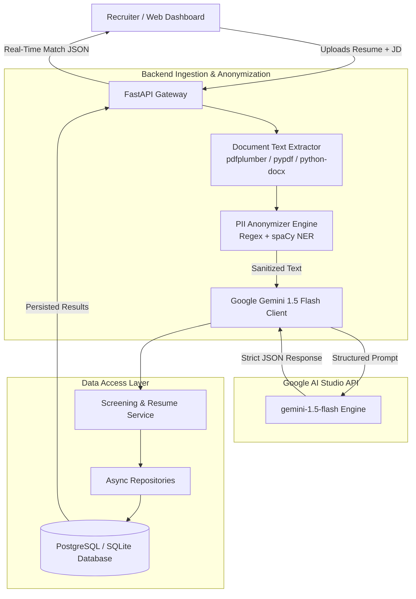
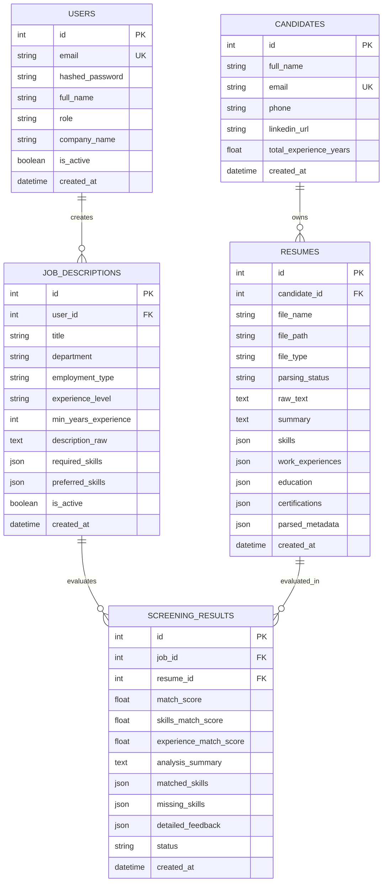

# Smart Resume Screener (AI-Powered ATS & Blind Screening Engine)

[](https://www.python.org/downloads/)
[](https://fastapi.tiangolo.com)
[](https://ai.google.dev/)
[](https://www.sqlalchemy.org/)
[](https://opensource.org/licenses/MIT)

**Author:** Sagnik Ray  
**Repository:** [https://github.com/CodingSagnik/smart-resume-screener.git](https://github.com/CodingSagnik/smart-resume-screener.git)

---

## 📌 Executive Overview

The **Smart Resume Screener** is an intelligent, bias-free applicant tracking and candidate screening system. It automates the extraction, redaction, and semantic matching of resumes against complex job descriptions using **FastAPI**, **SQLAlchemy 2.0 Async**, and **Google Gemini 1.5 Flash**.

To eliminate unconscious hiring bias, the platform implements an automated Personally Identifiable Information (PII) redaction layer (removing names, email addresses, phone numbers, and portfolio links) before transmitting data to the language model. The engine delivers granular, structured evaluation metrics (Skills Match, Experience Alignment, and Overall Fit) accompanied by visual skill gap tags and comprehensive recruiter justifications.

---

## 🏗️ System Architecture

The application is structured into modular layers covering presentation, business domain services, data access repositories, and database models.



---

## 🚀 Key Features

1. **Multi-Format Text Extraction**: Robust document ingestion supporting PDF (via `pdfplumber` with fallback to `pypdf`), DOCX (`python-docx`), and plain text files.
2. **Bias-Free PII Anonymization**: Automatic redaction of names, emails, phone numbers, and profile URLs to ensure strictly skill-based, objective evaluations.
3. **Structured Gemini 1.5 Flash Screening**: Leveraging `response_mime_type="application/json"` to enforce predictable schemas without hallucinations.
4. **Granular Multi-Dimensional Ratings**: 1 to 10 integer ratings for Skills Match, Experience Relevance, and Overall Role Fit.
5. **Visual Match Highlights**: Automatic tag classification of `matched_skills` (green badges) and `missing_skills` (red gap badges).
6. **Executive Recruiter Justifications**: Clear analytical feedback summarizing candidate strengths and potential ramp-up gaps.
7. **Production-Ready Architecture**: Asynchronous repository pattern, database migrations via Alembic, JWT authentication, and CORS security.

---

## 🤖 Exact Gemini LLM System Prompts

The backend utilizes two specialized prompts targeting `gemini-1.5-flash` with JSON schema enforcement.

### 1. Resume Parsing Prompt (`app/services/parser/llm_parser.py`)

```text
You are an expert ATS (Applicant Tracking System) and AI Resume Parser.
Your task is to analyze the provided anonymized resume text and extract all key professional details.

You MUST respond strictly with a valid, parseable JSON object matching this exact JSON schema:

{
  "summary": "Professional summary or career objective statement",
  "skills": ["Skill1", "Skill2", "Skill3"],
  "work_experiences": [
    {
      "company": "Company Name or [REDACTED_COMPANY]",
      "position": "Job Title",
      "location": "City, Country or Remote (optional)",
      "start_date": "YYYY-MM or YYYY (optional)",
      "end_date": "YYYY-MM or Present (optional)",
      "is_current": true/false,
      "description": "Overview of duties and impact",
      "highlights": ["Key achievement 1", "Key achievement 2"],
      "technologies": ["Tech1", "Tech2"]
    }
  ],
  "education": [
    {
      "institution": "University / College name",
      "degree": "Degree (e.g., Bachelor of Science, Master of Science)",
      "field_of_study": "Major / Field (e.g., Computer Science)",
      "start_year": "YYYY (optional)",
      "end_year": "YYYY (optional)",
      "grade_gpa": "GPA or grade (optional)"
    }
  ],
  "certifications": [
    {
      "name": "Certification Title",
      "issuer": "Issuing Organization (e.g., AWS, Microsoft, Google)",
      "issue_date": "YYYY (optional)",
      "expiry_date": "YYYY (optional)",
      "credential_id": "Credential ID (optional)"
    }
  ],
  "languages": ["English", "Spanish"],
  "total_experience_years": 5.5,
  "parsed_metadata": {
    "confidence_score": 0.95,
    "has_clear_dates": true
  }
}

CRITICAL RULES:
1. Return ONLY the JSON object. Do not include introductory text, explanations, or markdown formatting outside the JSON.
2. The candidate's PII has been deliberately redacted (e.g. [REDACTED_NAME], [REDACTED_EMAIL], [REDACTED_PHONE]) for bias-free blind screening. Do not attempt to guess or hallucinate personal identifying information.
3. Normalize all skills into distinct, concise technical and domain skill tags (e.g., "Python", "FastAPI", "Kubernetes", "Machine Learning").
4. Calculate total_experience_years as accurately as possible based on the work experience timeline.
```

### 2. Candidate Matching & Screening Prompt (`app/services/screening_service.py`)

```text
You are an expert AI Technical Recruiter and Talent Assessor.
Compare the following candidate resume with the provided job description and evaluate candidate fit objectively.

Rate candidate fit on a 1-10 scale with clear, analytical justification.

You MUST respond strictly with a valid, parseable JSON object matching this exact JSON schema:

{
  "skills_match_score": <integer from 1 to 10>,
  "experience_match_score": <integer from 1 to 10>,
  "overall_score": <integer from 1 to 10>,
  "matched_skills": ["Skill1", "Skill2"],
  "missing_skills": ["Skill3", "Skill4"],
  "justification": "A detailed paragraph explaining the rating, highlighting candidate strengths, experience relevance, and potential gaps relative to the job requirements."
}

SCORING GUIDELINES (1 to 10 Scale):
- 9-10 (Exceptional Match): Exceeds core requirements; strong relevant experience and all critical skills.
- 7-8 (Strong Match): Meets key requirements; strong skill overlap with minor easily-trained gaps.
- 5-6 (Moderate Match): Partial skill/experience alignment; meets some requirements but has noticeable gaps.
- 3-4 (Weak Match): Missing multiple critical skills or lacking required seniority/domain experience.
- 1-2 (Poor Match): Unrelated background or severe mismatch in technical stack and experience.

CRITICAL RULES:
1. Return ONLY the valid JSON object without surrounding markdown fences or conversational preambles.
2. Carefully inspect both required skills and nice-to-have skills against the candidate's skills and work history.
3. Provide an objective, bias-free justification paragraph explaining exactly why the candidate received the assigned scores.
```

---

## 🗄️ Database Schema Design

The relational database model connects recruiters, candidates, uploaded resumes, and match results.



---

## ⚙️ Quick Start Installation

### 1. Clone the Repository

```bash
git clone https://github.com/CodingSagnik/smart-resume-screener.git
cd smart-resume-screener
```

### 2. Configure Environment Variables

Create your `.env` file in the `backend/` directory:

```bash
cd backend
cp .env.example .env
```

Configure your Google Gemini API key:

```env
PROJECT_NAME="Smart Resume Screener API"
DATABASE_URL="sqlite+aiosqlite:///./smart_resume_screener.db"
SECRET_KEY="your-secret-jwt-key"

LLM_PROVIDER="gemini"
GEMINI_API_KEY="your-gemini-api-key-here"
GEMINI_MODEL="gemini-1.5-flash"
```

### 3. Install Dependencies & Run

```bash
# Create and activate virtual environment
python -m venv venv
source venv/bin/activate  # On Windows: .\venv\Scripts\activate

# Install required packages
pip install -r requirements.txt

# Start the application server
uvicorn app.main:app --reload --host 0.0.0.0 --port 8000
```

---

## 🖥️ Interactive Web Dashboard & Endpoints

Once the application is running, access the services in your browser:

* **Interactive Web Dashboard:** [http://localhost:8000/](http://localhost:8000/)
* **Interactive OpenAPI Swagger Docs:** [http://localhost:8000/api/v1/docs](http://localhost:8000/api/v1/docs)
* **ReDoc API Reference:** [http://localhost:8000/api/v1/redoc](http://localhost:8000/api/v1/redoc)
* **System Health Check:** [http://localhost:8000/health](http://localhost:8000/health)

### Primary API Endpoints

| Method | Endpoint | Description |
| :--- | :--- | :--- |
| `POST` | `/api/v1/screening/quick-screen` | 1-Click direct screening (uploads file + JD, executes PII redaction and Gemini matching) |
| `POST` | `/api/v1/resumes/upload` | Ingests PDF/DOCX/TXT resume and triggers PII anonymization |
| `POST` | `/api/v1/jobs/` | Creates a new structured job description |
| `POST` | `/api/v1/screening/jobs/{id}/screen/{resume_id}` | Runs semantic matching evaluation for an existing resume |
| `GET` | `/api/v1/screening/jobs/{id}/candidates` | Returns ranked screening evaluations sorted by score |

---

## 📄 License

This project is licensed under the MIT License. Developed with care by Sagnik Ray.
